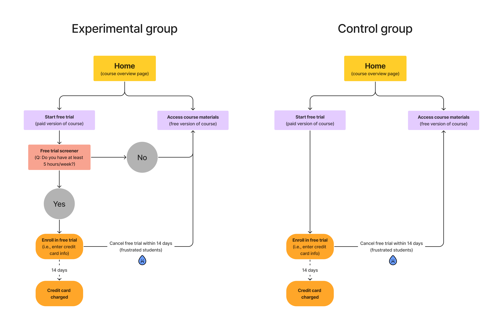

```{r setup, include=FALSE}
knitr::opts_chunk$set(echo = TRUE, message = FALSE)

library(dplyr)
library(tidyr)
library(purrr)
library(ggplot2)
```

### Experiment Overview: Free Trial Screener (from Instructions)

At the time of this experiment, Udacity courses currently have two options on the course overview page: "start free trial", and "access course materials".

- If the student clicks "start free trial", they will be asked to enter their credit card information, and then they will be enrolled in a free trial for the paid version of the course. After 14 days, they will automatically be charged unless they cancel first.

- If the student clicks "access course materials", they will be able to view the videos and take the quizzes for free, but they will not receive coaching support or a verified certificate, and they will not submit their final project for feedback.

In the experiment, Udacity tested a change where if the student clicked "start free trial", they were asked how much time they had available to devote to the course.

- If the student indicated 5 or more hours per week, they would be taken through the checkout process as usual.

- If they indicated fewer than 5 hours per week, a message would appear indicating that Udacity courses usually require a greater time commitment for successful completion, and suggesting that the student might like to access the course materials for free. At this point, the student would have the option to continue enrolling in the free trial, or access the course materials for free instead. This screenshot shows what the experiment looks like.

The hypothesis was that this might set clearer expectations for students upfront, thus *reducing the number of frustrated students who left the free trial because they didn't have enough time — without significantly reducing the number of students to continue past the free trial and eventually complete the course*. If this hypothesis held true, Udacity could improve the overall student experience and improve coaches' capacity to support students who are likely to complete the course.

The unit of diversion is a cookie, although if the student enrolls in the free trial, they are tracked by user-id from that point forward. The same user-id cannot enroll in the free trial twice. For users that do not enroll, their user-id is not tracked in the experiment, even if they were signed in when they visited the course overview page.

Any place "unique cookies" are mentioned, the uniqueness is determined by day; that is, the same cookie visiting on different days would be counted twice. User-ids are automatically unique since the site does not allow the same user-id to enroll twice.

**TL;DR** Can adding a screener question discourage enrollments from the students that will end up cancelling early?

### Step 1: Experimental design

First, let's use Figma to sketch out the website flow and better understand the experimental design. In particular, we need to know where this "free trial screener" question comes in. Note that users in the control group will be able to enroll in the free trial without being interrupted by the screener question.

```{r, out.width='7in', fig.cap='Experimental design flow chart', fig.pos='h', fig.align='center'}

```

<!-- {width=500px} -->

### Step 2: Select metrics

The instructions asks us consider 6 different metrics and identify which would be useful 'invariant metrics' versus 'evaluation metrics'. Invariant metrics are metrics that we don't expect to differ between the control and the experiment groups; these metrics act as 'sanity checks' to make sure the groups are comparable. Evaluation metrics, on the other hand, are used to assess the effect of the experiment.

In this case, our invariant metrics will be any metrics that are captured *before* users get to the free trial screener, which is the change of interest. Specifically, the invariant metrics will be:

- Number of cookies: number of unique cookies to view the course overview page

- Number of clicks: number of unique cookies to click the "Start free trial" button

- Click-through-probability: number of unique cookies to click the "Start free trial" button divided by number of unique cookies to view the course overview page

And our evaluation metrics will be:

- Gross conversion: number of user-ids to complete checkout and enroll in the free trial divided by number of unique cookies to click the "Start free trial" button (i.e., probability of enrolling, given click)

- Net conversion: number of user-ids to remain enrolled past the 14-day boundary (and thus make at least one payment) divided by the number of unique cookies to click the "Start free trial" button (i.e., probability of payment, given click)

- Retention: number of user-ids to remain enrolled past the 14-day boundary (and thus make at least one payment) divided by number of user-ids to complete checkout (i.e., probability of payment, given enroll)

Finally, the following metric could potentially be an evaluation metric, but the lack of a denominator makes it less meaningful than the other metrics.

- Number of user-id enrollments: number of users who enroll in the free trial

### Step 3: Refine hypotheses

From the Instructions, the stated 'hypothesis' - or goal - has two parts:

- Reducing the number of frustrated students who left the free trial because they didn't have enough time

- Not reducing the number of students to continue past the free trial and eventually complete the course

How do each of these goals map onto our selected evaluation metrics? Here are my hypotheses:

1. If the screener effectively screens out the time-strapped students, then *the proportion of students enrolling in the free trial - i.e., gross conversion - should decrease in the experiment group.*

2. If the time-strapped students have already filtered themselves out at an earlier step, then *net conversion should stay the same in the experiment group*. We don't want the screener question to majorly reduce the number of students that complete the [paid] version of the course; we just want to preemptively filter out the students that will need to drop the course anyway.

3. If students who enrolled even after seeing the screener question have sufficient time to complete the course (and are therefore less likely to cancel), then *retention should  increase in the experiment group.*

*Note: here we assume that if a student cancelled their free trial within 14 days, it was because they simply didn't have enough time. However, I'd argue that none of these metrics actually tell us WHY students leave the free trial within the 14-day window; for instance, maybe they have changes to their finances or career goals. If we only observe a modest experimental effect, I suspect it might be due to these alternate reasons.*

### Step 4: Measuring baseline variability

We need to know the variability to size the experiment correctly.

Let's first import the spreadsheet of baseline values for each metric. Then, to determine the sample size for each metric, I need to figure out how many units of analysis correspond to 5000 cookies visiting the homepage.
```{r}
baseline_values <- read.csv("data/final_project_baseline_values.csv") %>%
  select(-metric_description)

#Baseline number of cookies visiting the home page 
(baseline_cookies <- baseline_values %>% filter(metric == "number_cookies") %>% pull(value))

#Baseline number of cookies is larger than desired number of cookies (5,000) by a factor of 8
(scaling_factor = 5000/baseline_cookies)

#Convert baseline values for clicks and user ID enrollments accordingly. These are the denominators of our evaluation metrics and will be the sample size to use in the SE formula!
sample_size_for_se <- baseline_values %>%
  filter(metric == "number_cookies" | metric == "number_clicks" | metric == "number_user_enrollments") %>%
  mutate(across(value, list(n = ~.x * scaling_factor))) %>%
  select(metric_denominator = metric, n = value_n)
```

The probability-based metrics follow a binomial distribution, where mean = p and SE = sqrt(p(1-p)/N). So to calculate standard error analytically, we just need the mean probability (i.e., the baseline probability) and the sample size (i.e., denominator).
```{r}
analytical_se <- baseline_values %>%
  left_join(sample_size_for_se) %>%
  rename(p = value) %>%
  rowwise() %>%
  mutate(se = round(sqrt(p*(1-p)/n), digits = 4)) %>%
  mutate(p = round(p, digits = 4))

analytical_se
```

When the unit of analysis (i.e., denominator in the probability) matches the unit of diversion, the analytical variability will reasonably approximate the empirical variability. However, when the unit of analysis is larger than the unit of diversion (e.g., cookie vs. pageview), the assumption of independence is invalid and the analytical variability is likely an underestimate.

In our metrics, this shouldn't be an issue since the unit of diversion and analysis are relatively similar (cookie or user ID).

### Step 5: Experiment sizing

How many total pageviews (across both groups) do we need to collect to adequately power the experiment? (Pageviews = number of cookies to view course overview page)

To size the experiment, we need to perform a power analysis given the following specifications:

- alpha: 0.05

- beta: 0.20 (power, aka sensitivity = 1 - beta, i.e., proportion of experiments in which the null hypothesis is rejected)

- minimum detectable difference for each metric, aka practical significance, in terms of absolute change (dmin = 0.01 for gross conversion & retention, dmin = 0.0075 for net conversion)

- pooled standard error for each metric, assuming N = 1 in each group: sqrt(p * (1-p) * (1/Ncontrol + 1/Nexp))

The guidelines from Udacity materials suggest that normal distribution can be used instead of binomial distribution under the following conditions:

1. N * p > 5

2. N * (1 - p) > 5

Is that true in this case? Let's check.
```{r}
check <- analytical_se %>%
  mutate(check01 = n * p) %>%
  mutate(check02 = n * (1-p)) %>%
  select(metric, check01, check02)

check
```

Since both checks are >> 5, we are able to use a normal distribution.

Here, I'll use the code provided by the Udacity course to size the experiment. The general approach here is to try different Ns to get the smallest sample size that produces a power (sensitivity) of 80%.
```{r}
#The 'required_size' function in this script already has alpha set to 0.05 and beta set to 0.20. Could also use https://www.evanmiller.org/ab-testing/sample-size.html as a sanity check
source("experiment_sizing_from_udacity.R")

experiment_sizes <- analytical_se %>%
  filter(metric == "gross_conversion" | metric == "retention" | metric == "net_conversion") %>%
  mutate(p = round(p, digits = 4)) %>%
  mutate(d_min = ifelse(metric == "gross_conversion" | metric == "retention", 0.01, 0.0075)) %>%
  mutate(se_pooled_per_n = sqrt(p*(1-p)*(1/1 + 1/1))) %>% #assuming N = 1 per group
  mutate(size_per_group = pmap(list(se_pooled_per_n, d_min), ~required_size(s = ..1, d_min = ..2, Ns = seq(10, 1e8, 1)))) %>%
  mutate(size_across_groups = size_per_group * 2) %>%
  mutate(size_as_cookies = size_across_groups * (5000/n)) #need to calculate corresponding number of pageviews (cookies). Sample size n is per 5000 cookies.

experiment_sizes
```

Now we have to decide what percentage of Udacity's traffic that I would divert to this experiment, assuming that there were no other experiments I wanted to run simultaneously. Let's first look at 100% diversion; the change doesn't seem too risky and a high diversion percentage would let us complete the experiment in the shortest amount of time. 
```{r}
#From the baseline values, we know that the home page receives 40,000 pageviews per day.
baseline_cookies = 40000
diversion_proportion = 1

experiment_days <- experiment_sizes %>%
  mutate(cookies_per_day = baseline_cookies * diversion_proportion) %>%  #Number of cookies going into experiment based on diversion %
  mutate(number_days = size_as_cookies/cookies_per_day) %>%
  select(metric, size_as_cookies, number_days)

experiment_days
```

If we assume 100% diversion, we could measure gross conversion and net conversion within 16-17 days. However, if 100% diversion seems too risky, 80% diversion would also produce results within ~21 days. In all cases, measuring retention would take an unreasonable amount of time, so we will not use retention in subsequent analyses.
```{r}
diversion_proportion = 0.8

experiment_days <- experiment_sizes %>%
  mutate(cookies_per_day = 40000 * diversion_proportion) %>%  #Number of cookies going into experiment based on diversion %
  mutate(number_days = size_as_cookies/cookies_per_day) %>%
  select(metric, size_as_cookies, number_days)

experiment_days
```

### Step 6: Analysis

First, we need to import the data provided by Udacity. Here are the meanings of each column:

- Pageviews: Number of unique cookies to view the course overview page that day.

- Clicks: Number of unique cookies to click the course overview page that day.

- Enrollments: Number of user-ids to enroll in the free trial that day.

- Payments: Number of user-ids who who enrolled on that day to remain enrolled for 14 days and thus make a payment. (Note that the date for this column is the start date, that is, the date of enrollment, rather than the date of the payment. The payment happened 14 days later. Because of this, the enrollments and payments are tracked for 14 fewer days than the other columns.)

```{r}
control_data <- readxl::read_excel("data/final_project_results.xlsx", sheet = 1) %>%
  mutate(group = "control")

experiment_data <- readxl::read_excel("data/final_project_results.xlsx", sheet = 2) %>%
  mutate(group = "experiment")

data <- control_data %>%
  bind_rows(experiment_data) %>%
  select(group, everything()) %>%
  rename(Cookies = Pageviews) %>%
  mutate(click_through = Clicks/Cookies) %>%
  mutate(gross_conversion = Enrollments/Clicks) %>%
  mutate(net_conversion = Payments/Clicks)

names(data) <- tolower(names(data)) 
```

Then we need to run some sanity checks using our invariant metrics. Are they reasonably comparable between control and experiment?

from Instructions: If the invariant metric is a simple count that should be randomly split between the 2 groups, you can use a binomial test as demonstrated in Lesson 5. Otherwise, you will need to construct a confidence interval for a difference in proportions using a similar strategy as in Lesson 1, then check whether the difference between group values falls within that confidence level. If your sanity checks fail, look at the day by day data and see if you can offer any insight into what is causing the problem.

Our invariant metrics are:

- Number of cookies = # of unique cookies to view the course overview page

- Number of clicks = # of unique cookies to click the "Start free trial" button

- Click-through-probability = # of unique cookies to click the "Start free trial" button divided by number of unique cookies to view the course overview page

For number of cookies and number of clicks, will use a binomial test. Because each cookie is randomly assigned with a probability of 0.5, the confidence interval should be centered around 0.5.
```{r}
#Calculate total number of cookies and clicks in each group
cookies_clicks_sum <- data %>%
  group_by(group) %>%
  summarise(across(c(cookies, clicks), ~sum(.))) %>%
  ungroup() %>%
  arrange(desc(group)) #arrange so that experiment is first

#Calculate pooled SE for binomial: sqrt(p * (1-p) * (1/Ncontrol + 1/Nexp)). Remember, here p is 0.5
#Compute confidence intervals by multiplying SE by z-score (1.96). Remember, here we know the true p (0.5), so we will construct CI around it - not the observed mean!
#Calculate observed p and check whether observed fraction of cookies is within CI
cookies_clicks_results <- cookies_clicks_sum %>%
  pivot_longer(cols = c(cookies, clicks), values_to = "value") %>%
  pivot_wider(names_from = "group", values_from = "value") %>%
  rowwise() %>%
  mutate(se = sqrt(0.5*(1-0.5)/(control + experiment))) %>% #note: this is different formula than one used for difference in proportions! 
  mutate(m = 1.96 * se,
         lower = 0.5 - m,
         upper = 0.5 + m) %>%
  mutate(p_observed = experiment/(control+experiment)) %>% #observed fraction of "successes" (here, "success" = being assign to experiment group)
  ungroup()
  
cookies_clicks_results

#Theoretically, these calculations done by hand (above) should match the built-in binom.test function
binom.test(cookies_clicks_sum$cookies, p = 0.5, alternative = "two.sided")
binom.test(cookies_clicks_sum$clicks, p = 0.5, alternative = "two.sided")

#YES, the results match!
```

For click-through-probability, we'll check the difference between groups.
```{r}
#Calculate observed p, pooled across groups (here, p = clicks/cookies)
click_through_pooled <- cookies_clicks_sum %>%
  summarise(across(c(cookies, clicks), list(total = sum))) %>% 
  rowwise() %>%
  mutate(p = clicks_total/cookies_total)

p <- click_through_pooled$p

#Calculate observed difference in click-through-probability between groups
click_through_per_group <- cookies_clicks_sum %>%
  rowwise() %>%
  mutate(p = clicks/cookies)

d <- click_through_per_group$p[[1]] - click_through_per_group$p[[2]] #experiment minus control

#Calculate pooled SE for binomial: sqrt(p * (1-p) * (1/Ncontrol + 1/Nexp)). Remember, here p is pooled p. And Ncontrol and Nexp are number of cookies (denominator of click-through-probability)
#Calculate confidence intervals by multiplying SE by z-score (1.96)
click_through_results <- cookies_clicks_sum %>%
  pivot_longer(cols = c(cookies, clicks), values_to = "value") %>%
  pivot_wider(names_from = "group", values_from = "value") %>%
  filter(name == "cookies") %>%
  rowwise() %>%
  mutate(se = sqrt(p*(1-p)*(1/control + 1/experiment))) %>%
  mutate(m = 1.96 * se,
         d = d,
         lower = d - m,
         upper = d + m)

click_through_results

#Is difference within confidence interval?
d > click_through_results$lower
d < click_through_results$upper

#YES, no evidence to reject null hypothesis of d = 0

#Theoretically, the calculations done by hand (above) should match the built-in prop.test function for difference in proportions
click_through_proptest <- prop.test(x = click_through_per_group$clicks, n = click_through_per_group$cookies, p = NULL) #order is experiment, control
click_through_proptest #prop1 = experiment, prop2 = control

#YES, the results match!
```

from Instructions: for your evaluation metrics, calculate a confidence interval for the difference between the experiment and control groups, and check whether each metric is statistically and/or practically significant.

Here are the evaluation metrics:

- Gross conversion = # of user-ids to complete checkout and enroll in the free trial divided by number of unique cookies to click the "Start free trial" button (i.e., probability of enrolling, given click)

- Net conversion = # of user-ids to remain enrolled past the 14-day boundary (and thus make at least one payment) divided by the number of unique cookies to click the "Start free trial" button (i.e., probability of payment, given click)

```{r}
#Calculate total number of clicks, enrollments, and payments in each group -- but do not include data from the last two weeks (where there are clicks but not enrollments or payments) 
conversion_sum <- data %>%
  filter(!is.na(enrollments)) %>%
  group_by(group) %>%
  summarise(across(c(clicks, enrollments, payments), ~sum(., na.rm = TRUE))) %>%
  ungroup() %>%
  arrange(desc(group)) #arrange so that experiment is first
```

Gross conversion
```{r, out.width='4in', fig.cap='Results for gross conversion', fig.pos='h', fig.align='center'}
#Calculate observed p, pooled across groups (here, p = enrollments/clicks)
gross_conversion_pooled <- conversion_sum %>%
  summarise(across(c(enrollments, clicks), list(total = sum))) %>% 
  rowwise() %>%
  mutate(p = enrollments_total/clicks_total)

p <- gross_conversion_pooled$p

#Calculate observed difference in click-through-probability between groups
gross_conversion_per_group <- conversion_sum %>%
  rowwise() %>%
  mutate(p = enrollments/clicks)

d <- gross_conversion_per_group$p[[1]] - gross_conversion_per_group$p[[2]]

#Calculate pooled SE for binomial: sqrt(p * (1-p) * (1/Ncontrol + 1/Nexp)). Remember, here p is pooled p. And Ncontrol and Nexp are number of clicks (denominator of gross conversion)
#Calculate confidence intervals by multiplying SE by z-score (1.96)
gross_conversion_results <- conversion_sum %>%
  pivot_longer(cols = c(clicks, enrollments, payments), values_to = "value") %>%
  pivot_wider(names_from = "group", values_from = "value") %>%
  filter(name == "clicks") %>%
  rowwise() %>%
  mutate(se = sqrt(p*(1-p)*(1/control + 1/experiment))) %>%
  mutate(m = 1.96 * se,
         d = d,
         lower = d - m,
         upper = d + m)

gross_conversion_results

#Plot results
ggplot(gross_conversion_results, aes(x = NA, y = d)) + 
  geom_hline(yintercept = 0, linetype = 2, size = 1) + #No difference
  annotate("rect", xmin = -Inf, xmax = Inf, ymin = -0.01, ymax = 0.01, alpha = .1, fill = "blue") + #Minimum practical difference
  geom_point(size = 3) +
  geom_errorbar(aes(ymin = lower, ymax= upper), size = 1) +
  theme_bw(base_size = 18) +
  theme(axis.text.x = element_blank(),
        axis.ticks.x = element_blank()) +
  labs(x = "", y = "Estimated difference\n(experiment minus control)", title = "Gross conversion")

#Theoretically, the calculations done by hand (above) should match the built-in prop.test function for difference in proportions
click_through_proptest <- prop.test(x = conversion_sum$enrollments, n = conversion_sum$clicks, p = NULL) #order is experiment, control
click_through_proptest #prop1 = experiment, prop2 = control

#YES, the results match!
```

Net conversion
```{r, out.width='4in', fig.cap='Results for net conversion', fig.pos='h', fig.align='center'}
#Calculate observed p, pooled across groups (here, p = enrollments/clicks)
net_conversion_pooled <- conversion_sum %>%
  summarise(across(c(payments, clicks), list(total = sum))) %>% 
  rowwise() %>%
  mutate(p = payments_total/clicks_total)

p <- net_conversion_pooled$p

#Calculate observed difference in click-through-probability between groups
net_conversion_per_group <- conversion_sum %>%
  rowwise() %>%
  mutate(p = payments/clicks)

d <- net_conversion_per_group$p[[1]] - net_conversion_per_group$p[[2]]

#Calculate pooled SE for binomial: sqrt(p * (1-p) * (1/Ncontrol + 1/Nexp)). Remember, here p is pooled p. And Ncontrol and Nexp are number of clicks (denominator of gross conversion)
#Calculate confidence intervals by multiplying SE by z-score (1.96)
net_conversion_results <- conversion_sum %>%
  pivot_longer(cols = c(clicks, enrollments, payments), values_to = "value") %>%
  pivot_wider(names_from = "group", values_from = "value") %>%
  filter(name == "clicks") %>%
  rowwise() %>%
  mutate(se = sqrt(p*(1-p)*(1/control + 1/experiment))) %>%
  mutate(m = 1.96 * se,
         d = d,
         lower = d - m,
         upper = d + m)

net_conversion_results

#Plot results
ggplot(net_conversion_results, aes(x = NA, y = d)) + 
  geom_hline(yintercept = 0, linetype = 2, size = 1) + #No difference
  annotate("rect", xmin = -Inf, xmax = Inf, ymin = -0.0075, ymax = 0.0075, alpha = .1, fill = "blue") + #Minimum practical difference
  geom_point(size = 3) +
  geom_errorbar(aes(ymin = lower, ymax= upper), size = 1) +
  theme_bw(base_size = 18) +
  theme(axis.text.x = element_blank(),
        axis.ticks.x = element_blank()) +
  labs(x = "", y = "Estimated difference\n(experiment minus control)", title = "Net conversion")

#Theoretically, the calculations done by hand (above) should match the built-in prop.test function for difference in proportions
click_through_proptest <- prop.test(x = conversion_sum$payments, n = conversion_sum$clicks, p = NULL) #order is experiment, control
click_through_proptest #prop1 = experiment, prop2 = control

#YES, the results match!
```

from Instructions: If you have chosen multiple evaluation metrics, you will need to decide whether to use the Bonferroni correction. When deciding, keep in mind the results you are looking for in order to launch the experiment. Will the fact that you have multiple metrics make those results more likely to occur by chance than the alpha level of 0.05?

The Bonferroni correction is known to be overly conservative, so we will not use that metric. We might consider using false discovery rate (FDR) instead, but for just two metrics it seems unnecessary.

from Instructions: For each evaluation metric, do a sign test using the day-by-day breakdown. If the sign test does not agree with the confidence interval for the difference, see if you can figure out why.

In a sign test, we can think of each day as a "trial" and each day with a positive range (i.e., experiment > control) as a "success". We will add up the number of trials and successes.
```{r}
#First, need to organize data
data_for_sign_test <- data %>%
  select(group, date, gc = gross_conversion, nc = net_conversion) %>%
  pivot_wider(names_from = "group", values_from = c(gc, nc)) %>%
  mutate(gc_success = ifelse(gc_experiment > gc_control, 1, 0)) %>%
  mutate(nc_success = ifelse(nc_experiment > nc_control, 1, 0)) %>%
  filter(!is.na(gc_success))

#number of successes, number of trials
binom.test(sum(data_for_sign_test$gc_success), length(data_for_sign_test$gc_success))
binom.test(sum(data_for_sign_test$nc_success), length(data_for_sign_test$nc_success))
```

These results correspond with previous results, but if they didn't I might start by plotting the metrics over time - especially since the data collection period includes a holiday (Halloween). Interestingly, the only time that experimental gross conversion only surpasses the control group on Halloween and the 3 previous days (highlighted in blue).

```{r, out.width='6in', out.height='6in', fig.cap='A bit of data exploration (metrics over time)', fig.pos='h', fig.align='center'}
data_to_plot <- data %>%
  separate(col = "date", into = c("day", "date"), sep = ", ") %>%
  mutate(date = as.Date(date, "%b %e")) %>%
  mutate(date = format(date, format="%m-%d")) %>%
  filter(!is.na(gross_conversion)) %>%
  select(group, day, date, gross_conversion, net_conversion) %>%
  pivot_longer(cols = c(gross_conversion, net_conversion), names_to = "metric", values_to = "value") %>%
  mutate(metric = factor(metric, levels = c("gross_conversion", "net_conversion"), labels = c("Gross conversion\n(enrollments/clicks)", "Net conversion\n(payments/clicks)"))) %>%
  mutate(group = factor(group, levels = c("control", "experiment"), labels = c("Control", "Experiment")))

ggplot(data_to_plot, aes(x = date, y = value, group = group, colour = group)) + 
  annotate("rect", xmin = "10-28", xmax = "10-31", ymin = 0, ymax = 0.5, alpha = 0.25, fill = "blue") +
  geom_point(size = 2.5) +
  geom_line(aes(linetype = group), size = 1) +
  facet_grid(metric ~ .) +
  theme_bw(base_size = 14) +
  theme(panel.grid.major = element_blank(),
        strip.background = element_blank(),
        panel.border = element_rect(colour = "black", fill = NA),
        legend.position="bottom",
        axis.text.x = element_text(angle = 45, vjust = 1, hjust=1)) +
  scale_color_manual(values = c("grey20", "darkorchid")) +
  labs(x = "Date", y = "Value", colour = "Group", linetype = "Group") +
  ylim(0, 0.5) 
```

### Step 7: Make a recommendation

Summary of results:

- As predicted, the screener question does discourage students from enrolling in the free trial, since gross conversion (enrollments/clicks) was lower in the experimental group (mean difference: -0.0206, 95% CI: -0.0291 to -0.0120). This difference surpasses the practical significance value (-0.01).

- I also found no evidence that this screening effect led to statistically significant decreases in net conversion. However, confidence intervals encompassed a wide range of possible effects (95% CI: -0.011 to 0.0019), I so I cannot rule out declines in net conversion greater than acceptable practical difference (-0.0075).

Recommendation:

I would suggest **not** launching the experiment at this time. If time allowed, I would try to figure out why net conversion showed such a large range of possible effects. For example, I would try subsetting (slicing) the data to graphically explore whether certain audiences (e.g., countries) were showing more extreme experimental effects and thus contributing to wide confidence intervals we observed. If so, we might consider implementing the screener feature only in the countries that showed minimal effects on net conversion (likely after repeating the experiment in those groups with proper experiment sizing and power to detect an effect).


